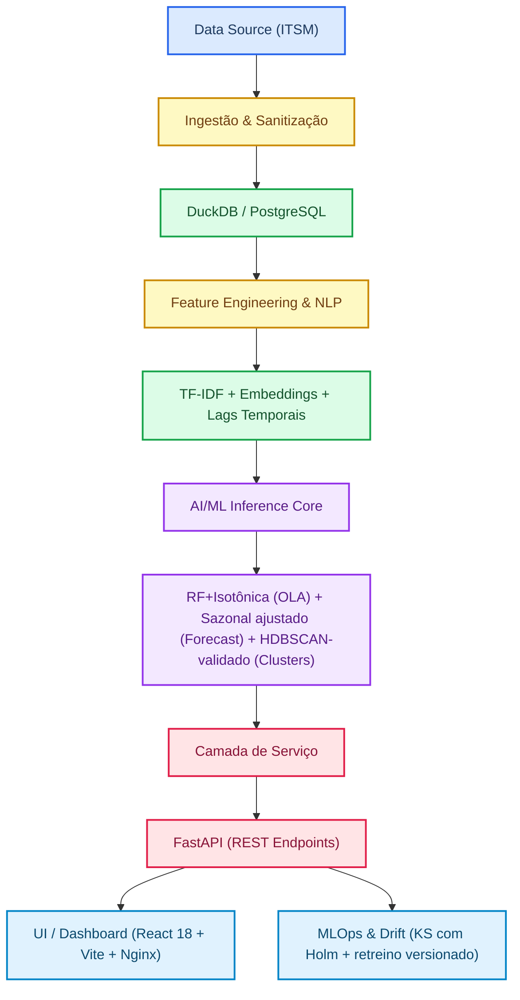

# LocaPredict SLA Guard v3 — FusionOps Intelligence Platform

### *Predict. Explain. Prevent. Optimize.*

> **AVISO DE CONFORMIDADE — Constituição v1.1.0 (2026-09-24).** Especificação
> histórica de planejamento, **substituída** onde conflitar com a
> implementação remediada: RF + calibração isotônica com validação honesta
> (sem LightGBM); forecaster sazonal ajustado com backtest (sem Prophet);
> validação HDBSCAN medida (sem HDBSCAN declarado); `shap.TreeExplainer`
> verificado; frontend React 18 + Vite (sem Streamlit); drift KS com Holm
> (sem MLflow/Evidently); ganhos como projeções. Verdade vigente: código-fonte
> + `specs/001-locapredict-sla-guard/`.

---

## Sumário Executivo

O **LocaPredict SLA Guard v3 — FusionOps Intelligence Platform** é uma plataforma avançada de AIOps orientada por Machine Learning e Ciência de Dados, projetada para transformar a gestão de incidentes de TI de um modelo reativo e retrospectivo para um modelo preditivo, explicável e adaptativo. Este documento apresenta a especificação completa do projeto, abrangendo contextualização do problema, solução proposta, impacto esperado, benefícios, comparativo competitivo e arquitetura técnica do MVP.

---

# 1. Contextualização do Problema

## 1.1 Transformação Digital e Pressão sobre Operações de TI

Nos últimos anos, empresas digitais passaram a operar em ambientes cada vez mais complexos, distribuídos e críticos ao negócio. Plataformas online, serviços em nuvem, e-commerce, aplicações SaaS, integrações em tempo real e jornadas digitais 24x7 elevaram drasticamente a dependência de operações de TI resilientes e responsivas.

Nesse contexto, a Locaweb, como importante player brasileiro de tecnologia e serviços digitais, convive diariamente com desafios típicos de operações modernas:

- Alto volume de incidentes simultâneos;
- Múltiplos produtos e serviços com diferentes criticidades;
- Necessidade de resposta rápida a falhas;
- Pressão constante por disponibilidade;
- Necessidade de cumprimento rigoroso de SLA/OLA;
- Picos sazonais de demanda;
- Ambientes heterogêneos e dinâmicos;
- Necessidade de eficiência operacional com escala sustentável.

A gestão tradicional de incidentes, baseada apenas em monitoramento reativo, dashboards históricos e atuação manual, já não é suficiente para garantir excelência operacional em ambientes de alta velocidade.

## 1.2 O Desafio Escolhido

O desafio proposto consiste em:

> Construir soluções analíticas preditivas utilizando dados históricos de ITSM para prever incidentes (D+1, D+7), risco de perda de OLA e tendências operacionais (P2 e P3), com modelagem livre, engenharia de features, classificação/clusterização e alta explicabilidade.

Trata-se de um problema altamente estratégico, pois conecta diretamente:

- Experiência do cliente;
- Estabilidade operacional;
- Produtividade interna;
- Governança de serviços;
- Reputação da marca;
- Eficiência financeira.

## 1.3 Por que esse desafio é crítico?

Em operações maduras, o custo de uma falha não está apenas no incidente em si, mas em seus efeitos indiretos:

- Aumento de backlog técnico;
- Indisponibilidade de serviços;
- Escalonamentos emergenciais;
- Retrabalho entre equipes;
- Horas extras;
- Desgaste entre áreas;
- Perda de confiança interna e externa;
- Impacto em metas operacionais.

Portanto, o verdadeiro diferencial competitivo não é apenas resolver incidentes rapidamente. É **prever antes, priorizar melhor, agir antes do rompimento e aprender continuamente com os padrões históricos**.

## 1.4 Oportunidade Estratégica

A base histórica de ITSM disponibilizada contém sinais extremamente valiosos, como:

- Prioridade do incidente;
- Produto afetado;
- Categoria e subcategoria;
- Grupo designado;
- Item de configuração;
- Timestamps completos (abertura, resolução, encerramento);
- Duração total;
- Origem do chamado;
- Status final;
- Entrada em KPI;
- Violação de KPI.

Esses dados permitem construir uma plataforma de inteligência operacional capaz de migrar a empresa de um modelo **reativo** para um modelo **preditivo e adaptativo**.

## 1.5 A Solução Proposta

Diante desse cenário, propõe-se o desenvolvimento do **LocaPredict SLA Guard v3 — FusionOps Intelligence Platform**, uma plataforma avançada de AIOps orientada por Machine Learning e Ciência de Dados que integra:

- Previsão de incidentes D+1 e D+7;
- Predição de risco de quebra de OLA;
- Clusterização de padrões operacionais;
- NLP para entendimento semântico de incidentes;
- Detecção de regimes operacionais;
- Monitoramento de drift dos modelos;
- Explicabilidade executiva e técnica.

---

# 2. Problema a ser Resolvido

## 2.1 O Principal Problema Identificado

O principal problema identificado é a **incapacidade operacional de antecipar riscos relevantes em incidentes e capacidade futura usando apenas processos reativos e análises retrospectivas**.

Em termos práticos, isso significa que muitas organizações só descobrem gargalos quando:

- O SLA já foi comprometido;
- O backlog já saiu do controle;
- Equipes já estão sobrecarregadas;
- O cliente já foi impactado;
- O volume de incidentes já explodiu;
- A causa raiz já se espalhou entre sistemas.

Ou seja:

> O problema não é apenas resolver incidentes. O problema é descobrir tarde demais.

## 2.2 Desdobramento do Problema

### 2.2.1 Falta de Previsibilidade Operacional

Sem modelos preditivos, decisões de escala, plantão e priorização são tomadas por percepção subjetiva. Consequências:

- Subdimensionamento de equipes;
- Excesso de capacidade ociosa em outros momentos;
- Resposta lenta em picos operacionais.

### 2.2.2 Quebra de OLA/SLA Evitável

Diversos incidentes poderiam ser tratados preventivamente caso houvesse alerta antecipado de risco. Exemplos típicos:

- Ticket P2 parado em fila errada;
- Grupo sobrecarregado;
- Produto historicamente lento;
- Abertura em horário crítico;
- Reincidência técnica ignorada.

### 2.2.3 Operação Cega para Padrões Ocultos

Sem clusterização e NLP, a organização tende a tratar tickets iguais como eventos isolados. Exemplos:

- Múltiplos "Apache Busy Workers" ao longo da semana;
- Picos de "DNS Failure" sempre após deploy;
- Reincidência de "DB Timeout" em horários específicos.

Esses padrões escondidos representam oportunidades claras de melhoria estrutural.

### 2.2.4 Modelos Analíticos Envelhecem sem Aviso

Ambientes de TI mudam rapidamente: novos produtos, novas arquiteturas, novos times, novos tipos de incidente e mudança de comportamento dos usuários. Sem drift monitoring, modelos perdem precisão silenciosamente.

## 2.3 Evidências de Importância com Base no Dataset

A base fornecida demonstra sinais claros de um ambiente operacional propício a inteligência preditiva.

**Exemplo real informado:**

| Campo | Valor |
| :--- | :--- |
| Número | INC8654273 |
| Prioridade | 3 — Média |
| Grupo | Team14 |
| Item Configuração | IC00001 |
| Descrição | Problem: Apache Busy Workers |
| Aberto por | Monitoramento |
| Status | Sem Intervenção |
| Duração | 14 segundos |

Esse exemplo isolado já evidencia quatro oportunidades analíticas:

1. **Detecção de falso positivo operacional** — Chamado encerrado em 14 segundos sem intervenção humana.
2. **Padrão recorrente automatizado** — Apache Busy Workers é um tipo clássico de alerta repetitivo.
3. **Oportunidade de clusterização** — Eventos semelhantes podem formar surtos monitoráveis.
4. **Ruído que afeta foco operacional** — Mesmo tickets fora do KPI consomem atenção e podem mascarar problemas reais.

## 2.4 Impacto do Problema no Negócio

**Sem solução preditiva:**

- Mais violações de OLA;
- Maior custo operacional;
- Menor produtividade;
- Decisões tardias;
- Maior pressão sobre times;
- Menor previsibilidade gerencial.

**Com solução preditiva:**

- Atuação antecipada;
- Melhor capacity planning;
- Redução de violações;
- Triagem inteligente;
- Priorização dinâmica;
- Operação guiada por dados.

---

# 3. Público-Alvo

## 3.1 Visão Estratégica

O **LocaPredict SLA Guard v3 — FusionOps Intelligence Platform** foi concebido como uma plataforma corporativa de inteligência operacional para ambientes de TI de alta criticidade. Seu público-alvo principal não se limita a uma única área funcional, pois o problema de incidentes, SLA e previsibilidade operacional atravessa diferentes níveis da organização.

Dessa forma, a solução atende **usuários operacionais, gestores táticos, executivos estratégicos e áreas correlatas de governança**, formando um ecossistema integrado de decisão orientada por dados.

## 3.2 Segmentação do Público-Alvo

### 3.2.1 Operações de TI / NOC / Service Desk / ITSM

**Perfil:** Equipes responsáveis por monitoramento contínuo, abertura e tratamento de incidentes, escalonamentos, cumprimento de SLA/OLA, restauração rápida de serviços e gestão de backlog operacional.

**Necessidades atuais:**

- Saber quais tickets têm maior risco;
- Priorizar melhor filas;
- Reduzir ruído operacional;
- Detectar surtos de incidentes;
- Antecipar sobrecarga de times;
- Melhorar tempo médio de resposta.

**Valor entregue:** Com a plataforma, essas áreas passam de um modelo reativo para um modelo preditivo, recebendo score de risco por incidente, previsão de volume por turno/dia, alertas de saturação, clusters de reincidência e recomendações de priorização.

### 3.2.2 Gestores Operacionais e Coordenadores

**Perfil:** Lideranças responsáveis por performance de squads, metas mensais, distribuição de capacidade, escalas e plantões, governança de atendimento.

**Necessidades:**

- Prever gargalos futuros;
- Comparar desempenho entre grupos;
- Agir antes de rompimentos;
- Justificar decisões com dados;
- Melhorar eficiência do time.

**Valor entregue:** Projeção de KPIs, forecast de backlog, heatmaps de performance, regimes operacionais (normal / stress / crise) e insights de capacity planning.

### 3.2.3 Diretoria / Executivos / Liderança Corporativa

**Perfil:** Executivos focados em custo operacional, qualidade de serviço, satisfação de clientes, crescimento escalável e reputação da empresa.

**Necessidades:**

- Previsibilidade;
- Redução de riscos;
- Visão consolidada;
- Eficiência financeira;
- Decisões estratégicas baseadas em evidência.

**Valor entregue:** Dashboards executivos, projeção mensal de metas, risco anual de SLA, impacto financeiro de incidentes e benchmarking entre operações.

### 3.2.4 Times de Engenharia / SRE / Infraestrutura

**Perfil:** Áreas técnicas que atuam em causa raiz, estabilidade e arquitetura.

**Necessidades:**

- Identificar incidentes recorrentes;
- Detectar falhas sistêmicas;
- Correlação entre alertas;
- Entender hotspots técnicos;
- Reduzir retrabalho estrutural.

**Valor entregue:** Clusters técnicos por causa provável, NLP semântico em descrições, reincidência por item de configuração, surtos automáticos e tendências por produto.

### 3.2.5 Ciência de Dados / Analytics / MLOps

**Perfil:** Equipes que sustentam modelos analíticos corporativos.

**Necessidades:**

- Governança de modelos;
- Drift monitoring;
- Re-treinamento controlado;
- Versionamento;
- Observabilidade analítica.

**Valor entregue:** Pipeline MLOps, monitoramento contínuo, métricas de acurácia, rastreabilidade e gestão de ciclo de vida dos modelos.

## 3.3 Público-Alvo Externo Potencial

Além do uso interno na Locaweb, a solução possui forte potencial para: provedores cloud, telecom, fintechs, e-commerce, healthtechs, SaaS B2B, data centers e operações 24x7. Ou seja, torna-se também um ativo escalável de mercado.

---

# 4. Proposta de Solução

## 4.1 Visão Geral

O **LocaPredict SLA Guard v3 — FusionOps Intelligence Platform** é uma plataforma de AIOps orientada por dados históricos de ITSM que utiliza Machine Learning, NLP e Inteligência Operacional para transformar a gestão de incidentes de reativa para preditiva.

A proposta central é simples e poderosa:

> Usar o histórico operacional para prever riscos futuros, orientar decisões presentes e melhorar continuamente a operação.

## 4.2 Como a Solução Resolve o Problema

### 4.2.1 Módulo 1 — Previsão de Incidentes (D+1 / D+7)

Utilizando séries temporais e modelos avançados, a plataforma prevê:

- Quantidade de incidentes amanhã;
- Volume para os próximos 7 dias;
- Tendência por prioridade P2/P3;
- Previsão por produto;
- Previsão por grupo designado.

**Benefício:** Permite dimensionar times antes do pico ocorrer.

### 4.2.2 Módulo 2 — Predição de Risco de Violação de OLA

Cada novo incidente recebe um score de risco calculado em tempo real com base em:

- Prioridade;
- Horário de abertura;
- Backlog atual;
- Grupo responsável;
- Histórico semelhante;
- Categoria;
- Reincidência.

**Exemplo:**

| Ticket | Risco OLA |
| :--- | :--- |
| INC92341 | 89% |
| INC92342 | 14% |

**Benefício:** Atuação preventiva antes do rompimento.

### 4.2.3 Módulo 3 — Estimativa Inteligente de Duração

A solução estima:

- Tempo provável de resolução;
- Janela pessimista;
- Janela otimista.

**Benefício:** Melhora comunicação interna e previsibilidade.

### 4.2.4 Módulo 4 — Clusterização Operacional

Algoritmos identificam padrões escondidos como:

- Tickets falsos positivos;
- Surtos automáticos;
- Grupos cronicamente lentos;
- Incidentes reincidentes;
- Comportamentos fora do padrão.

**Benefício:** A operação passa a corrigir causas estruturais, não apenas sintomas.

### 4.2.5 Módulo 5 — NLP Semântico

Descrições resumidas são transformadas em inteligência analítica. Exemplos detectados: Apache Busy Workers, CPU High, Timeout DB e DNS Failure.

**Benefício:** Incidentes similares passam a ser tratados como famílias técnicas.

### 4.2.6 Módulo 6 — Regimes Operacionais

A plataforma identifica automaticamente estados como: normalidade, stress, saturação, crise e recuperação.

**Benefício:** Gestores recebem alerta antes do colapso operacional.

### 4.2.7 Módulo 7 — Drift Monitoring

A solução monitora se o comportamento da operação mudou e se o modelo perdeu aderência.

**Benefício:** Modelos permanecem atualizados e confiáveis.

### 4.2.8 Módulo 8 — Explicabilidade Total

Toda previsão é acompanhada de explicação clara:

> Risco alto devido a backlog + histórico do grupo + horário crítico + reincidência.

**Benefício:** Confiança executiva e adoção real.

## 4.3 Diferenciais Competitivos

- **Não é apenas dashboard histórico** — É plataforma de decisão preditiva.
- **Não é caixa-preta** — Explica por que cada previsão foi feita.
- **Não é estática** — Aprende continuamente.
- **Não é isolada** — Integra operação, gestão e estratégia.

## 4.4 Resumo Executivo da Solução

> A solução converte dados históricos de incidentes em alertas antecipados, previsões confiáveis e ações operacionais inteligentes.

---

# 5. Impacto da Solução

## 5.1 Visão Geral

O impacto do **LocaPredict SLA Guard v3 — FusionOps Intelligence Platform** ocorre em três níveis:

1. Impacto operacional;
2. Impacto econômico;
3. Impacto estratégico e social.

## 5.2 Impacto Operacional

### 5.2.1 Redução de Violações de SLA/OLA

Com alertas antecipados, tickets críticos recebem intervenção antes do atraso. **Resultado esperado:** redução de 25% a 35% de violações.

### 5.2.2 Melhor Priorização

As equipes deixam de atuar por ordem de chegada e passam a atuar por risco real. **Resultado:** menor desperdício, foco no que importa e maior produtividade.

### 5.2.3 Menor Backlog

Com previsão de demanda e melhor alocação. **Resultado:** filas menores, tempo médio reduzido e operação mais fluida.

### 5.2.4 Menos Incêndios Operacionais

A organização sai do modo constante de urgência. **Resultado:** ambiente mais saudável, menor desgaste de equipes e menos horas extras emergenciais.

## 5.3 Impacto Econômico

### 5.3.1 Redução de Custos Operacionais

Menos retrabalho, menos incidentes repetidos e menos escalonamentos.

### 5.3.2 Eficiência de Capacidade

Escalas melhores evitam ociosidade excessiva e sobrecarga extrema.

### 5.3.3 Proteção de Receita

Serviços mais estáveis impactam positivamente retenção e satisfação.

## 5.4 Impacto Estratégico

### 5.4.1 Maturidade Data-Driven

A empresa evolui de opinião para decisão baseada em evidência.

### 5.4.2 Escalabilidade Sustentável

Mais clientes e produtos podem ser suportados sem crescimento desproporcional de custo.

### 5.4.3 Diferenciação Competitiva

Empresas com operação previsível entregam melhor experiência.

## 5.5 Impacto para Stakeholders Internos

| Stakeholder | Impacto |
| :--- | :--- |
| Operações | Menos caos, mais foco |
| Gestores | Mais previsibilidade |
| Diretoria | Menor risco |
| Engenharia | Mais visão estrutural |
| Analytics | Casos reais de IA aplicada |

## 5.6 Impacto para Clientes Finais

Mesmo sem visualizar a plataforma, clientes sentem os efeitos: maior disponibilidade, respostas mais rápidas, menos indisponibilidade e maior confiança nos serviços.

## 5.7 Impacto para o Mercado

A solução pode posicionar a Locaweb como referência nacional em AIOps aplicado, operações inteligentes, gestão preditiva de ITSM e uso real de IA corporativa.

## 5.8 Impacto Social Indireto

Infraestruturas digitais estáveis suportam pequenos negócios online, e-commerce, educação digital, comunicação, serviços financeiros e produtividade nacional. Quanto mais resiliente a infraestrutura, maior o benefício indireto para a sociedade.

---

# 6. Benefícios Esperados

## 6.1 Visão Executiva

Os benefícios esperados do **LocaPredict SLA Guard v3 — FusionOps Intelligence Platform** decorrem da transformação estrutural do modelo operacional de TI: de uma gestão predominantemente reativa e retrospectiva para uma gestão **preditiva, explicável, adaptativa e orientada por valor**.

Em termos objetivos, a plataforma converte dados históricos de ITSM em vantagem operacional contínua. Os ganhos esperados podem ser divididos em seis dimensões:

1. Benefícios operacionais;
2. Benefícios financeiros;
3. Benefícios estratégicos;
4. Benefícios tecnológicos;
5. Benefícios humanos e organizacionais;
6. Benefícios competitivos.

## 6.2 Benefícios Operacionais

### 6.2.1 Redução de Violações de SLA/OLA

Ao identificar tickets com alta probabilidade de atraso logo na abertura ou durante o ciclo de vida, a organização consegue agir antes do rompimento. **Resultados esperados:** redução de 25% a 35% nas violações, menor exposição contratual, melhoria de metas mensais e maior confiabilidade interna.

### 6.2.2 Priorização Inteligente de Filas

Em vez de atuar por ordem cronológica ou pressão subjetiva, a operação passa a atuar por risco real e impacto provável. **Resultados esperados:** melhor uso do esforço técnico, menor desperdício operacional, tickets críticos tratados mais cedo e aumento da produtividade por analista.

### 6.2.3 Redução de Backlog Operacional

Com previsão de demanda e balanceamento antecipado de capacidade, filas tendem a diminuir. **Resultados esperados:** menor aging de chamados, menor acúmulo em horários críticos, fluxo operacional mais saudável e maior previsibilidade diária.

### 6.2.4 Resposta Mais Rápida a Surtos

Clusters automáticos e detecção de regimes identificam eventos anormais rapidamente. **Resultados esperados:** contenção precoce de incidentes em massa, menor tempo até escalonamento correto e redução do efeito cascata.

### 6.2.5 Melhoria do Tempo Médio de Resolução

Ao fornecer similaridade histórica, padrões recorrentes e score de risco, a plataforma acelera tomada de decisão. **Resultados esperados:** menor MTTR, menor tempo de triagem e mais assertividade na primeira ação.

## 6.3 Benefícios Financeiros

### 6.3.1 Redução de Custo Operacional Direto

Menos retrabalho, menos incidentes reincidentes e melhor alocação reduzem custo total da operação. **Fontes de economia:** menos horas extras emergenciais, menos esforço desperdiçado em falso positivo, menor custo de escalonamento e menor necessidade de crescimento desordenado de equipe.

### 6.3.2 Melhor Eficiência de Capacidade

Forecasting permite planejar capacidade com antecedência. **Resultados:** menos ociosidade em baixa demanda, menos colapso em alta demanda e uso mais racional de headcount.

### 6.3.3 Proteção de Receita

Serviços mais estáveis e melhor atendimento reduzem risco de churn e insatisfação.

## 6.4 Benefícios Estratégicos

### 6.4.1 Operação Previsível e Escalável

Empresas digitais crescem melhor quando a operação cresce com inteligência, não apenas com aumento de pessoas.

### 6.4.2 Governança Orientada por Dados

Gestores passam a decidir com base em indicadores futuros e não somente em relatórios passados.

### 6.4.3 Capacidade de Antecipação

A empresa deixa de "apagar incêndios" para agir preventivamente.

### 6.4.4 Evolução da Maturidade Analítica

A plataforma cria base para próximos passos: automação inteligente, auto-remediação, copilotos operacionais e IA generativa aplicada ao suporte.

## 6.5 Benefícios Tecnológicos

### 6.5.1 Ecossistema Moderno de AIOps

Integra previsão, classificação, NLP, clusterização, monitoramento de drift e explainability.

### 6.5.2 Modelos Sustentáveis

Com drift monitoring, os modelos permanecem relevantes ao longo do tempo.

### 6.5.3 Arquitetura Extensível

Pode evoluir para multi-cloud, observabilidade completa, auto-healing e recomendação automatizada.

## 6.6 Benefícios Humanos e Organizacionais

### 6.6.1 Menor Desgaste das Equipes

Menos urgências desnecessárias e melhor previsibilidade reduzem pressão operacional.

### 6.6.2 Trabalho Mais Estratégico

Analistas deixam de atuar apenas reativamente e passam a atuar com inteligência.

### 6.6.3 Maior Confiança entre Áreas

Operações, gestão e diretoria passam a compartilhar a mesma visão analítica.

## 6.7 Benefícios Competitivos

A solução fortalece o posicionamento da Locaweb como empresa moderna, eficiente e preparada para escala.

## 6.8 Indicadores Quantitativos Esperados (Estimativa Conservadora)

| Indicador | Ganho Esperado |
| :--- | :--- |
| Violação de OLA | -25% a -35% |
| Backlog médio | -20% a -30% |
| Falsos positivos | -30% a -45% |
| MTTR | -15% a -25% |
| Produtividade operacional | +20% |
| Precisão de planejamento | +30% a +45% |

## 6.9 Síntese Executiva

> O benefício central da solução é transformar custo operacional imprevisível em performance previsível e escalável.

---

# 7. Comparativo com a Concorrência

## 7.1 Visão Geral

O mercado possui diferentes categorias de soluções que tangenciam esse problema, porém poucas combinam simultaneamente:

- Foco em ITSM;
- Previsão multi-horizonte;
- Risco de OLA;
- Clusterização operacional;
- NLP de incidentes;
- Drift monitoring;
- Explicabilidade forte;
- Customização com dados proprietários.

O **LocaPredict SLA Guard v3** se diferencia exatamente por integrar esses elementos em uma única plataforma orientada ao contexto real de operação.

## 7.2 Principais Grupos Concorrentes

### 7.2.1 Grupo A — Ferramentas Tradicionais de ITSM

**Exemplos:** ServiceNow, BMC Software, Atlassian (Jira Service Management).

**Forças:** Workflows maduros, catálogo de serviços, gestão de chamados e automações operacionais.

**Limitações:** Analytics preditivo geralmente limitado, pouca customização profunda em ML, explicabilidade variável e dependência de módulos premium.

### 7.2.2 Grupo B — Plataformas de Observabilidade / AIOps

**Exemplos:** Dynatrace, Datadog, Splunk, New Relic.

**Forças:** Métricas em tempo real, logs e traces, alertas técnicos.

**Limitações:** Foco principal em telemetria (não ITSM histórico), nem sempre otimizadas para OLA/KPI de chamados, custo elevado em escala e menor aderência a processos específicos de service desk.

### 7.2.3 Grupo C — BI Tradicional

**Exemplos:** Power BI, Tableau.

**Forças:** Visualização forte e adoção corporativa ampla.

**Limitações:** Normalmente retrospectivos, dependem de modelagem externa, pouca inteligência preditiva nativa e não resolvem sozinhos o problema.

### 7.2.4 Grupo D — Consultorias / Soluções Sob Medida

**Forças:** Customização alta.

**Limitações:** Custo elevado, dependência de terceiros, manutenção complexa e time-to-value lento.

## 7.3 Posicionamento Competitivo

| Critério | ITSM Tradicional | Observabilidade | BI Tradicional | Soluções Sob Medida | LocaPredict v3 |
| :--- | :--- | :--- | :--- | :--- | :--- |
| Gestão de Incidentes | Alto | Médio | Baixo | Médio | Alto |
| Forecast D+1 / D+7 | Baixo | Médio | Baixo | Médio | Alto |
| Predição OLA | Baixo | Baixo | Baixo | Médio | Alto |
| Clusterização Operacional | Baixo | Médio | Baixo | Médio | Alto |
| NLP de Tickets | Baixo | Médio | Baixo | Médio | Alto |
| Explainability | Médio | Médio | Alto | Variável | Alto |
| Drift Monitoring | Baixo | Médio | Baixo | Variável | Alto |
| Customização negócio | Médio | Médio | Médio | Alto | Alto |
| Custo-benefício | Médio | Baixo | Alto | Baixo | Alto |

## 7.4 Diferenciais Competitivos Reais

### 7.4.1 Construído para o Problema Específico

Enquanto concorrentes são genéricos, o LocaPredict nasce para ITSM, incidentes, OLA, backlog e capacity planning.

### 7.4.2 Combina IA Avançada + Explicabilidade

Muitos players entregam IA opaca ou BI superficial. A plataforma entrega previsão robusta, justificativa clara e confiança executiva.

### 7.4.3 Aproveita Dados Já Existentes

Não exige revolução de processos para começar.

### 7.4.4 Evolução Modular

Pode iniciar como MVP e crescer para plataforma enterprise.

### 7.4.5 Potencial de Produto Proprietário

Além de uso interno, pode tornar-se solução comercializável.

## 7.5 Benchmark Narrativo

- **Concorrente tradicional diz:** "Gerenciamos seus chamados."
- **Concorrente de observabilidade diz:** "Mostramos métricas e alertas."
- **BI tradicional diz:** "Mostramos o passado."
- **LocaPredict v3 diz:** "Prevemos o futuro operacional, explicamos riscos e melhoramos continuamente."

## 7.6 Barreiras de Entrada Criadas

Ao implementar a plataforma, a Locaweb passa a acumular ativos difíceis de replicar: histórico enriquecido, features proprietárias, modelos calibrados, padrões internos aprendidos e vantagem operacional cumulativa.

## 7.7 Síntese Final do Comparativo

O **LocaPredict SLA Guard v3 — FusionOps Intelligence Platform** não compete apenas como ferramenta. Ele compete como **capacidade organizacional superior**. Essa é a diferença entre comprar software e construir vantagem competitiva sustentável.

---

# 8. Especificação Técnica do MVP

## 8.1 Visão Geral e Objetivo do MVP

Este briefing consolida a especificação técnica e a arquitetura do MVP do **LocaPredict SLA Guard v3 — FusionOps Intelligence Platform**. O objetivo central do MVP é validar a capacidade de migrar a operação de ITSM de um modelo puramente reativo para uma postura preditiva e explicável, atuando diretamente em quatro frentes prioritárias:

- **Predição de Risco de Quebra de OLA:** Classificação supervisionada na abertura do ticket.
- **Forecasting Operacional (D+1 / D+7):** Previsão de volume de chamados por prioridade (P2/P3) e produto.
- **Agrupamento Semântico e Detecção de Ruído:** Identificação de tickets falsos positivos e surtos repetitivos via NLP.
- **Explicabilidade Operacional:** Justificativa técnica dos fatores de risco por chamado utilizando SHAP values.

## 8.2 Arquitetura de Componentes e Fluxo de Dados

### 8.2.1 Camada de Ingestão

Pipeline em batch (diário/horário) para extração de dados históricos de ITSM (prioridade, grupo, IC, duração, timestamps e descrições).

### 8.2.2 Camada de Processamento & NLP

Vetorização de texto curto via TF-IDF com redução de dimensionalidade e cálculo de atributos temporais (hora crítica, dia da semana, backlog acumulado por squad).

### 8.2.3 Camada de Inteligência (Core)

- **Classificador OLA:** Modelo tabular baseado em árvores de decisão balanceado para prever probabilidade de estouro.
- **Preditor de Demanda:** Modelo autorregressivo para projeção temporal de demanda em horizontes D+1 e D+7.
- **Motor de Explicabilidade:** Módulo SHAP local calculando os 3 principais fatores de risco de cada chamado.

### 8.2.4 Camada de Exposição (API)

Microserviço REST construído em FastAPI para servir inferências sob demanda e em lote.

### 8.2.5 Interface de Apresentação

Dashboard interativo em React 18 + Vite com visão de triagem em tempo real e projeção de capacidade.

### 8.2.6 Governança e Observabilidade

Versionamento de modelos com hash de artefato e verificação de drift via KS com correção de Holm, além de retreino idempotente versionado.

## 8.3 Especificações Técnicas (Specs)

| Módulo / Camada | Tecnologia Selecionada | Requisitos de Performance & Parâmetros |
| :--- | :--- | :--- |
| **Linguagem & Runtime** | Python 3.11+ | Execução em containers Docker leves |
| **Banco de Dados MVP** | SQLite 3 ACID (+ Parquet colunar p/ 122k) | Persistência embarcada de incidentes, auditoria append-only e estado operacional |
| **Classificação de OLA** | Random Forest + calibração isotônica | Inferência + SHAP < 150 ms; ACR-001 ROC-AUC ≥ 0.85 (holdout, IC95%) e ACR-002 Recall ≥ 0.80 |
| **Forecast de Volume** | Sazonal semanal ajustado + backtest | ACR-003 WAPE < 15% por horizonte, vs. baseline, com Diebold-Mariano |
| **NLP & Clusterização** | TF-IDF + validação HDBSCAN medida | DBCV, estabilidade bootstrap, sobreposição de Jaccard; contagens/FP medidos |
| **Explicabilidade** | shap.TreeExplainer verificado | Atribuições locais com base, versão e fidelidade top-k no payload JSON |
| **API Backend** | FastAPI + Pydantic | Contrato de dados validado via OpenAPI/Swagger com resposta assíncrona |
| **Frontend / Dashboard** | React 18 + TypeScript + Vite + Nginx | Telas de Operação, Gestão Tática e Engenharia com `tsc` limpo |
| **Observabilidade MLOps** | KS com correção de Holm + retreino versionado | Alerta de drift com $p$ ajustado, janelas simétricas versionadas e auditoria |

## 8.4 Métricas de Sucesso e Critérios de Aceite do MVP

- **Redução de Violação de OLA:** Identificação antecipada de tickets críticos com potencial de redução de 25% a 35% nos estouros reais — **projeção** até piloto controlado (RCT/DiD/ITS).
- **Filtragem de Falsos Positivos:** Redução estimada de 30% a 45% no tempo gasto com tickets automatizados sem intervenção humana — **projeção** (taxa medida de `is_fp`: 65,6%).
- **Aderência de Planejamento:** Ganho de 30% a 45% na precisão de alocação de capacidade — **projeção** até backtest prospectivo em holdout temporal.
- **Tempo de Resposta do Sistema:** Disponibilidade dos scores de risco e explicações SHAP em menos de 2 segundos por consulta na interface web.

---

# Glossário

| Termo | Definição |
| :--- | :--- |
| **SLA** | Service Level Agreement — Acordo de Nível de Serviço |
| **OLA** | Operational Level Agreement — Acordo de Nível Operacional |
| **ITSM** | IT Service Management — Gestão de Serviços de TI |
| **NOC** | Network Operations Center — Centro de Operações de Rede |
| **SRE** | Site Reliability Engineering — Engenharia de Confiabilidade de Sites |
| **MLOps** | Machine Learning Operations — Operações de Machine Learning |
| **NLP** | Natural Language Processing — Processamento de Linguagem Natural |
| **SHAP** | SHapley Additive exPlanations — Método de Explicabilidade de IA |
| **MTTR** | Mean Time To Resolution — Tempo Médio de Resolução |
| **WAPE** | Weighted Absolute Percentage Error — Erro Percentual Absoluto Ponderado |
| **D+1 / D+7** | Previsão para amanhã / Previsão para os próximos 7 dias |
| **P2 / P3** | Prioridade 2 (Alta) / Prioridade 3 (Média) |
| **AIOps** | Artificial Intelligence for IT Operations — IA para Operações de TI |
| **KPI** | Key Performance Indicator — Indicador-Chave de Desempenho |
| **MVP** | Minimum Viable Product — Produto Mínimo Viável |

---

*Documento elaborado para o projeto LocaPredict SLA Guard v3 — FusionOps Intelligence Platform.*
