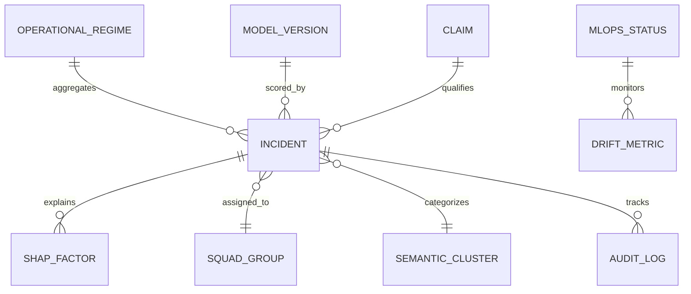

# Data Model Specification: LocaPredict SLA Guard v3 (Remediation, Constitution v1.1.0)

**Feature**: [spec.md](./spec.md)
**Status**: Completed
**Date**: 2026-09-24

---

## 1. Entity-Relationship Overview

---

## 2. Core Domain Entities

### 2.1 Incident (remediated)
Prior fields retained (id, title, description, category, priority P1-P4,
group, product, config_item, opened_by, status, sla_deadline,
sla_remaining_minutes, estimated_violation, duration_seconds, created_at,
updated_at). Changes:

| Campo | Tipo | Regra |
|---|---|---|
| `label_source` | ENUM(`synth_rule`,`kpi_obs`) | Origem do rótulo; nunca conflar. |
| `ola_breached_synth` | BOOLEAN | Regra duração > limite SLA e não-FP. |
| `kpi_violado_obs` | BOOLEAN | Observado (0.20%); endpoint confirmatório. |
| `p_raw` | FLOAT 0-1 | Saída RF não calibrada (auditoria). |
| `p_calibrated` | FLOAT 0-1 | Pós-Platt/Isotonic; único valor exibível como %. |
| `risk_score` | INTEGER 0-100 | `round(100*p_calibrated)`; heurística afim banida. |
| `threshold_tau` | FLOAT | Limiar justificado versionado. |
| `is_automated_fp` | BOOLEAN | Sem intervenção ou duração ≤ 30 s. |
| `claim_label` | ENUM(`measured`,`projection`) | Todo agregado herdado (FP/MTTR). |

Validation: P1 rows MUST carry `p1_n1_warning=true`; cluster counts MUST
reconcile within 1% or ingestion fails closed.

### 2.2 SHAPFactor (verified only)
| Campo | Tipo | Descrição |
|---|---|---|
| `feature` | VARCHAR(64) | Dimensão real do espaço de 55 features. |
| `value` | FLOAT | Atribuição TreeExplainer (Shapley). |
| `base_value` | FLOAT | Valor esperado do modelo (eficiência). |
| `impact` | ENUM | Sinal de `value`. |
| `explainer_version` | VARCHAR(32) | Versão shap + seed. |
| `fidelity_topk` | FLOAT | Queda de score ao remover top-k. |

Fixed-weight rows are schema violations.

### 2.3 OperationalRegime
Fields retained (current, confidence, previous, changed_at, trend,
active_triggers, description) plus `threshold_version` and `hysteresis_band`.
Confidence MUST come from versioned calibration log, never fixed constants.
Transitions: normal/stress/saturation/crisis/recovery per versioned counts with
hysteresis; override requires Admin + audit reason.

### 2.4 ForecastProjection
| Campo | Tipo | Descrição |
|---|---|---|
| `horizon` | ENUM(D+1,D+7) | Horizonte. |
| `model_id` | VARCHAR(64) | Forecaster ajustado versionado. |
| `peak_value`/`peak_date` | FLOAT/VARCHAR | Pico projetado. |
| `capacity_threshold` | FLOAT | Teto nominal (95.0). |
| `is_over_capacity` | BOOLEAN | Pico > teto. |
| `wape_holdout` | FLOAT | WAPE de backtest por horizonte (constantes banidas). |
| `wape_baseline` | FLOAT | WAPE do baseline seasonal-naive. |
| `dm_pvalue` | FLOAT | Diebold-Mariano vs. baseline. |

### 2.5 SemanticCluster
| Campo | Tipo | Descrição |
|---|---|---|
| `id`/`name` | VARCHAR | Identidade do cluster. |
| `algorithm` | VARCHAR | hdbscan/bertopic + versão (rules = baseline apenas). |
| `incident_count` | INTEGER | Deve reconciliar ±1% com loader. |
| `avg_risk_score` | FLOAT | Sobre `p_calibrated`. |
| `false_positive_rate` | FLOAT | Medida, nunca assertiva. |
| `dbcv`/`stability` | FLOAT | Validade e bootstrap. |
| `recommended_action` | TEXT | Prescrição com `claim_label`. |

### 2.6 DriftMetric
| Campo | Tipo | Descrição |
|---|---|---|
| `feature_name` | VARCHAR(64) | Uma das 6 features do painel. |
| `p_value`/`statistic` | FLOAT | KS bicaudal computado (hardcode banido). |
| `p_adjusted` | FLOAT | Bonferroni/FDR. |
| `status` | ENUM | stable/warning/drifted por p ajustado. |
| `reference_version` | VARCHAR(32) | Baseline versionada. |
| `window_n`/`power_note` | INTEGER/TEXT | n simétrico + poder divulgado. |

### 2.7 AuditLog / ModelVersion / Claim
AuditLog append-only (timestamp, incident_id, action ASSIGN/ESCALATE/NOTIFY/
REGIME_OVERRIDE/RETRAIN, user_sub, details_json before/after). ModelVersion
(id, train_window, cv_auc, cv_prauc, delong_ci, brier, threshold_tau, artifact
hash). Claim (metric, value, label measured/projection, window, script hash);
projeções sem piloto controlado permanecem `projection`.

---

## 3. State Machines

### 3.1 Incident
`open → in_progress → escalated → closed` per spec; reassign/escalate recompute
`p_calibrated` and append AuditLog; closed requires FP or N2 resolution.

### 3.2 Regime
Versioned thresholds with hysteresis; `crisis` (≥8 critical ≥80% or ≥5 P1),
`saturation` (≥4 critical or ≥25 active), `stress` (≥2 critical or ≥18 active),
else `normal`; `recovery` on sustained post-containment decline.
